*CI* 

# Chaos Organizer
[!Chaos Organizer - Backend](https://cw-ahj-diploma-chaos-organizer-back.vercel.app)
## Основные функции:

* ### Сохранение в истории ссылок и текстовых сообщений;
* ### Ссылки кликабельны и отображаются как ссылки;  
  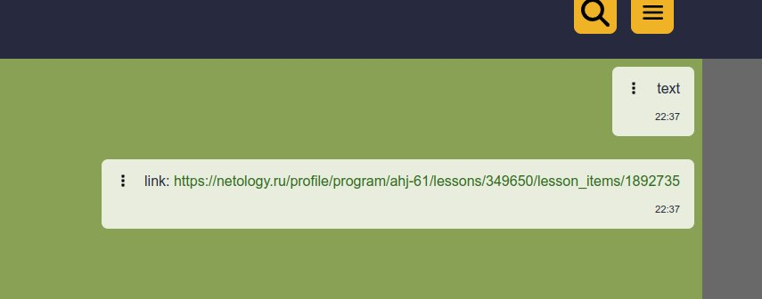
* ### Сохранение в истории изображений, видео и аудио;
  
  
  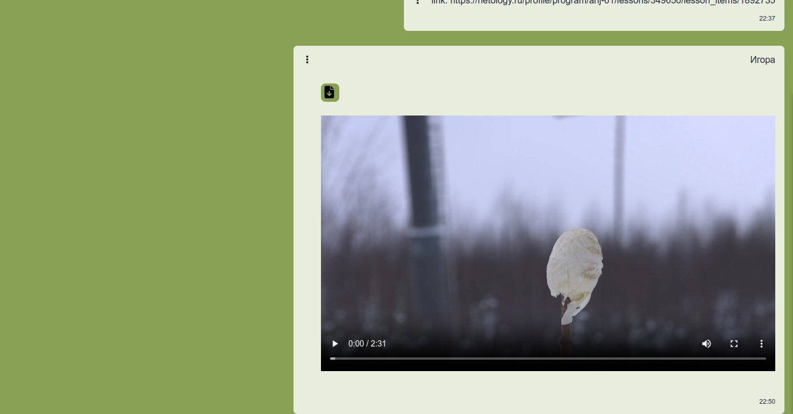
  
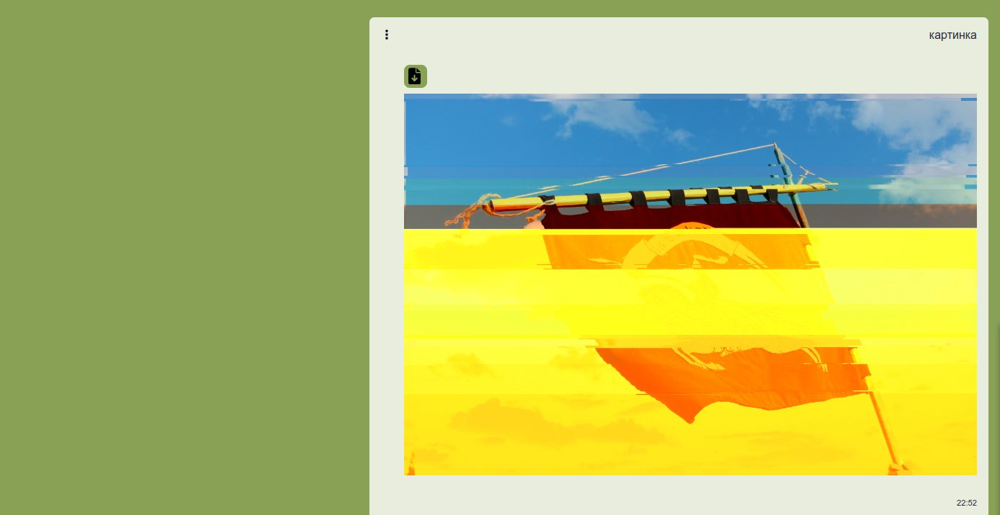
* ### Скачивание файлов на компьютер пользователя;  
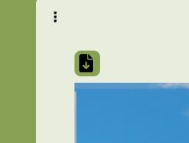
* ### Ленивая подгрузка;  

## Дополнительные функции:

* ### Синхронизация процессов добавления / удаления сообщений,  
### добавления в избранное и удаления из него,  
### добавления / удаления контента при удалении сообщения с этим контентом,
### создания / удаления пина
* ### Поиск по сообщениям 
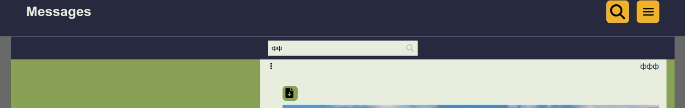
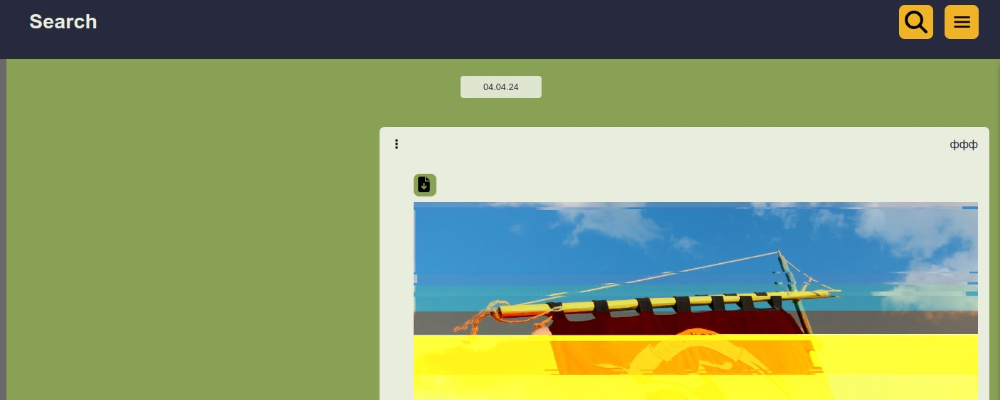
* ### Отправка геолокации;
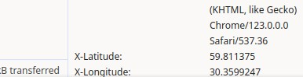
* ### Воспроизведение видео/аудио,   
### замьючивание и регулировка громкости при помощи кастомных кнопок
### Отрисовка прогресса воспроизведения видео, аудио
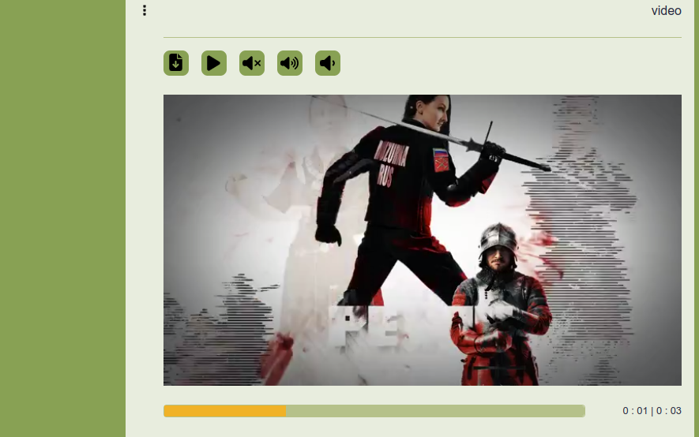
* ### Закрепление (pin) сообщений
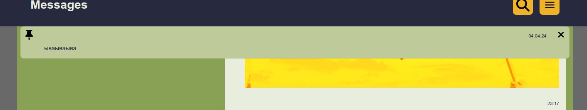
* ### Добавление сообщения в избранное

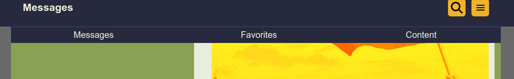
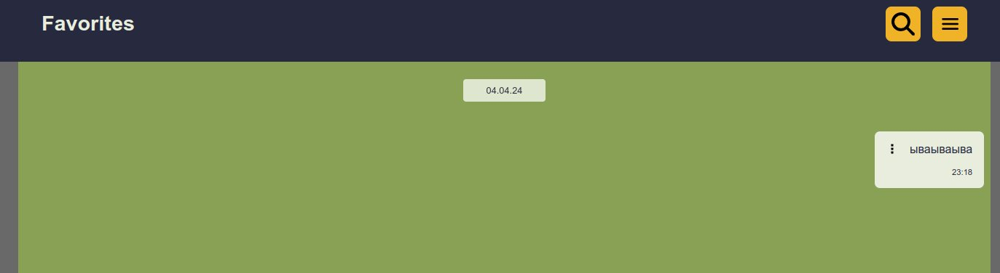
* ### Просмотр вложений по категориям: аудио, видео, изображения, другие файлы

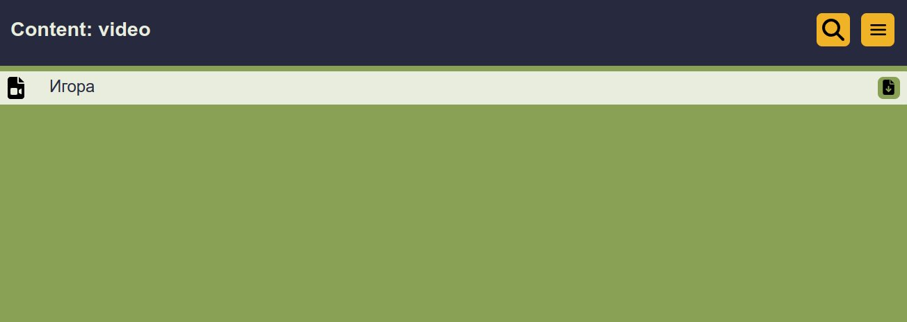
* ### Кнопка для подключения дефолтной базы данных

